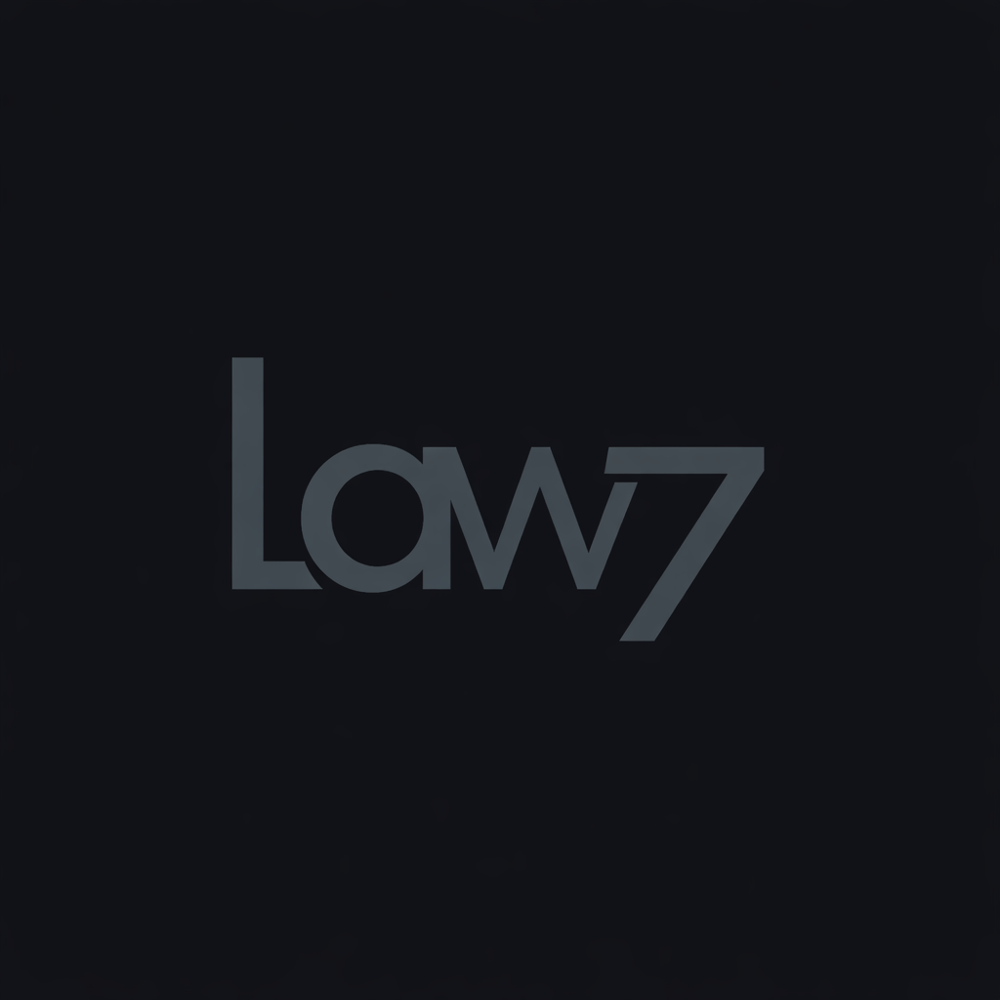

# Law7 - Up-to-date Legal Documents For AI Assistants

[](LICENSE)
[](package.json)

## Without Law7

AI assistants rely on outdated training data for laws:

- LLMs use training data from years ago
- Hallucinated legal articles that don't exist
- Generic answers without specific legal citations
- Unable to track legal changes or amendments

## With Law7

Law7 MCP pulls up-to-date, version-specific legal documents directly from official government sources and places them into your AI conversation.

Ask questions like:

```
What are the notice periods for terminating an employment contract in Russia?
```

```
What changes were made to the Russian Labor Code in 2025?
```

Law7 fetches current legal documents right into your AI's context. No tab-switching, no hallucinated articles, no outdated legal information.

## Legal Disclaimer

**IMPORTANT**: This project provides text information from open sources only. See [DISCLAIMER.md](docs/DISCLAIMER.md) for full details.

- NOT for official use in court or government bodies
- NO guarantee of accuracy, completeness, or timeliness
- Always consult qualified lawyers for legal matters
- AGPL-3.0 licensed - modifications must be shared

## Installation

### Claude Desktop

<details>
<summary><b>Quick Start (Recommended)</b></summary>

```bash
# Build the server
npm run build

# Add to Claude Desktop
claude mcp add law7 --node \path\to\folder\law7\dist\index.js
```

</details>

<details>
<summary><b>Detailed Instructions</b></summary>

**Step 1: Build and Test the Server**

```bash
npm run build
npm start
```

**Step 2: Add to Claude Desktop**

Option A - Via config file (`C:\Users\<user>\AppData\Roaming\Claude\claude_desktop_config.json`):

```json
{
  "mcpServers": {
    "law7": {
      "command": "node",
      "args": ["/path/to/folder/law7/dist/index.js"],
      "env": {}
    }
  }
}
```

**Important**: The `mcpServers` is an **object**, not an array. Each server is a key with `command` and `args` properties.

**Step 3: Test with Claude Desktop**

Once added, the law7 MCP server appears in your chat with these tools:
- `list-countries` - List available countries
- `get-statistics` - Get database statistics
- `query-laws` - Search legal documents by text
- `get-law` - Get specific document by eo_number

**Example query**:
```
Can you search for documents about "трудовой договор" in Russia and show me the results?
```

</details>

### ChatGPT and Other AI Assistants

MCP support is coming to ChatGPT and other AI platforms. When available, installation will follow a similar pattern to Claude Desktop.

## Important Tips

### Add a Rule

To automatically invoke Law7 for legal questions, add a rule to your CLAUDE.md file:

```txt
Always use Law7 MCP when I need legal information, document lookup, or legal analysis without me having to explicitly ask.
```

### Specify Country

Currently only Russia is supported, but you can specify for clarity:

```
What are the labor laws in Russia regarding overtime?
```

### Query Historical Versions

Ask for specific dates to get historical legal versions:

```
What was the Russian Labor Code article 80 text on January 1, 2024?
```

## Available Tools

Law7 MCP provides the following tools that AI assistants can use:

| Tool | Description |
|------|-------------|
| `query-laws` | Search legal documents by semantic/keyword search |
| `get-law` | Retrieve specific document by eo_number |
| `list-countries` | List supported countries (currently Russia) |
| `get-statistics` | Get database statistics |
| `get-code-structure` | Get structure of consolidated legal codes |
| `get-article-version` | Get article version at specific date |
| `trace-amendment-history` | Track amendment history of articles |

## Architecture

This project uses a **hybrid architecture** with two separate components:

- **Data Pipeline (Python)**: Crawls, parses, and indexes legal documents into local database
- **MCP Server (TypeScript)**: Queries the local database and serves results to AI assistants

```
Python Pipeline → PostgreSQL + Qdrant → TypeScript MCP Server → AI
```

### Components

| Component | Language | Location |
|-----------|----------|----------|
| Data Pipeline | Python | `/scripts` |
| MCP Server | TypeScript | `/src` |
| Docker | Compose | `/docker` |

## Phase 1: Current Implementation (Russia)

**Status**: Operational

- **Documents**: 157,730 Russian legal documents (2022-2026)
- **Sources**:
  - [pravo.gov.ru](http://pravo.gov.ru/) - Official Russian legal publication portal (primary)
  - [kremlin.ru](http://kremlin.ru/) - Presidential decrees, Constitution
  - [government.ru](http://government.ru/) - Government resolutions, procedure codes
- **Codes**: All 16 major Russian legal codes imported:
  - Constitution (KONST_RF)
  - Civil Code (4 parts: GK_RF, GK_RF_2/3/4)
  - Criminal Code (UK_RF)
  - Labor Code (TK_RF)
  - Tax Code (2 parts: NK_RF, NK_RF_2)
  - Family, Housing, Land codes (SK_RF, ZhK_RF, ZK_RF)
  - Administrative Code (KoAP_RF)
  - Procedure Codes (GPK_RF, APK_RF, UPK_RF)

See [docs/DATA_PIPELINE.md](docs/DATA_PIPELINE.md) for complete data pipeline documentation.

## Phase 2: Future Vision (Global)

**Status**: Planned - See [docs/VISION.md](docs/VISION.md)

- Multi-country support
- Decentralized data distribution (IPFS, libp2p)
- Community verification system
- Country adapter pattern for adding new jurisdictions
- Delta updates and change tracking

## Quick Start (Development)

> **Note**: Default ports are PostgreSQL **5433**, Redis **6380**, Qdrant **6333** (to avoid conflicts with other projects).

### 1. Start Docker Services

```bash
cd docker
docker-compose up -d
```

### 2. Run Initial Data Sync (Python)

```bash
# Using Poetry
poetry run python scripts/sync/initial_sync.py
```

### 3. Start MCP Server (TypeScript)

```bash
npm install
npm run build
npm start
```

### 4. Test with MCP Inspector

```bash
npx @modelcontextprotocol/inspector node dist/index.js
```

## Dependencies

### TypeScript (MCP Server)
- `@modelcontextprotocol/sdk` - MCP protocol
- `pg` - PostgreSQL client
- `@qdrant/js-client-rest` - Qdrant vector DB client
- `ioredis` - Redis client

### Python (Data Pipeline)
- `pandas` - Data processing
- `sqlalchemy` - Database ORM
- `beautifulsoup4` - HTML parsing
- `pdfplumber` - PDF text extraction
- `sentence-transformers` - Embeddings (multilingual models)
- `qdrant-client` - Vector DB client
- `torch` - PyTorch with CUDA support (for GPU acceleration)

**Hardware Requirements for GPU Acceleration**:
- NVIDIA GPU with CUDA support (tested on RTX 3060 12GB)
- CUDA 12.x compatible drivers

## Project Structure

```
law7/
├── src/                     # TypeScript - MCP Server (PUBLIC)
│   ├── index.ts             # MCP server entry point
│   ├── server.ts            # MCP server setup
│   ├── config.ts            # Configuration
│   ├── tools/               # MCP tools
│   ├── db/                  # Database clients
│   └── models/              # Data models
│
├── scripts/                 # Python - Data Pipeline (PRIVATE)
│   ├── core/                # Core utilities (config, db, batch_saver)
│   ├── crawler/             # Pravo.gov.ru API crawler
│   ├── parser/              # PDF/HTML parsing
│   ├── indexer/             # Embeddings and indexing
│   ├── consolidation/       # Code consolidation engine
│   └── sync/                # Sync scripts (initial, daily)
│
├── docs/                    # Documentation
│   ├── DATA_PIPELINE.md     # Data pipeline guide
│   ├── VISION.md            # Future global architecture
│   └── DISCLAIMER.md        # Legal disclaimer
│
└── docker/                  # Docker services
    ├── docker-compose.yml   # PostgreSQL, Qdrant, Redis
    └── postgres/
        └── init.sql         # Database schema
```

## More Documentation

- [DATA_PIPELINE.md](docs/DATA_PIPELINE.md) - Complete data pipeline guide
- [VISION.md](docs/VISION.md) - Future global architecture
- [DISCLAIMER.md](docs/DISCLAIMER.md) - Legal disclaimer
- [CONTRIBUTING.md](CONTRIBUTING.md) - Development guidelines

## License

AGPL-3.0 - see [LICENSE](LICENSE) for details.

This means:
- Source code is freely available
- Any modifications must be shared under the same license
- If you run a modified version on a server and provide services to users, you must make the source code available to those users
